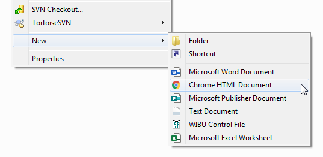
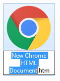
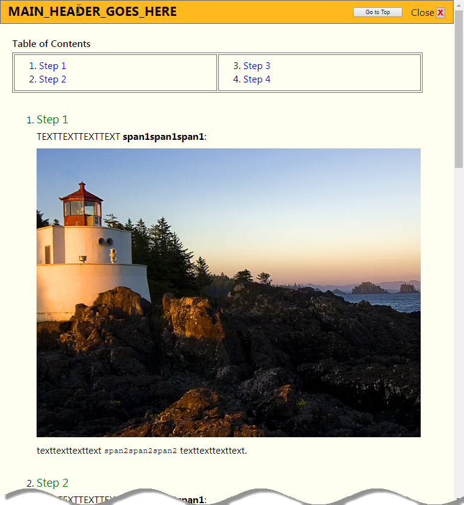
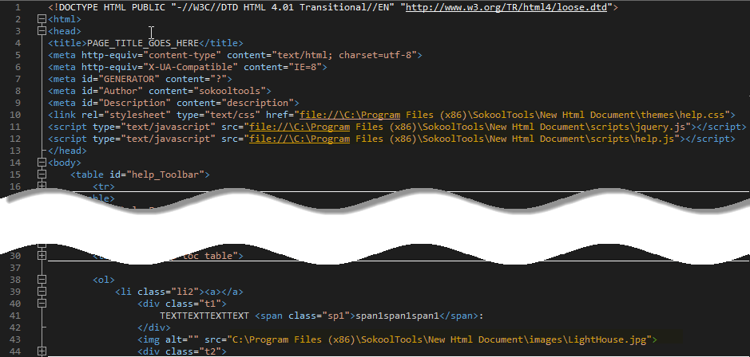

## New HTML Document

This repository contains the code necessary to easily add a new '<b>Chrome HTML Document</b>' menu item to the existing 
right-click '<b>New</b>' context menu item built into Windows Explorer:

Simply clone this repository to your PC; Run (as in double-click) the enclosed command file 
"<i>install.cmd</i>" and wait for it to complete. (NOTE: You must have Administrator privilege to run the install)

From now on, whenever you right-click in a Windows Explorer window pane and select the 
'<b>New</b>' \| '<b>Chrome HTML Document</b>' menu item, a default HTML template file will be created at the selected 
location such as :

You can provide a new valid file name for it at that time, or just leave it as is.

Launching the resultant HTML file in a web browser will reveal some default data easily customizable per your 
own requirements : 

 

Notice internal to the html file are references to a default set of folders named: 'images', 'scripts', and 'themes'.
These folders are part of the dependencies automatically copied to the "%ProgramFiles(x86)%" folder by the installer.

